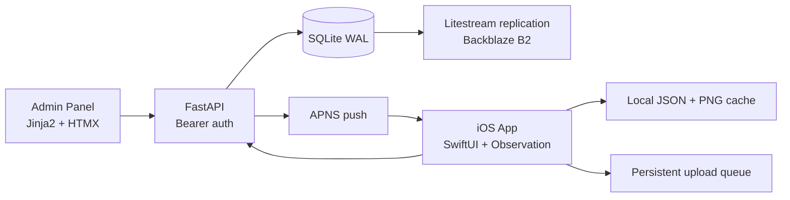

<div align="center">

*An intentional record of love, written in software.*

<br>

# Exhibit A

A private iOS reading experience for two people,
shaped like a legal filing and kept like a letter.

<br>


-7E6A58?style=flat&labelColor=F8F1E3&color=7E6A58)


</div>

<p align="center">· · ·</p>

## A Quiet Opening

Exhibit A is not a product, and it was never meant to be one.

It is a private, living artifact: a contract, a correspondence log, and a sealed notebook,
made to hold affection in a form that can be revisited, signed, and kept.

The software is deliberate because the person it was made for matters.

<p align="center">· · ·</p>

## What This Is

Exhibit A combines two surfaces:

- A native iOS app (`ExhibitA/`) for reading and signing.
- A FastAPI backend (`app/`) with a small admin panel for filing new content.

Content appears in three modes:

- **The Contract**: a page-curl book with cover, table of contents, article pages, signatures, and final page.
- **Filed Letters**: an editorial list and markdown-rendered detail reader.
- **Sealed Thoughts**: short, plain-text memoranda with minimal friction.

Everything follows an intentionally warm legal-editorial voice: structured, gentle, and personal.

## Why It Was Made

The project began from a simple tension:

- meaningful things were being said,
- but they were disappearing into chat history.

Exhibit A turns that ephemera into record.
It keeps promises, notes, and affectionate filings in one place,
with enough permanence to feel like something you can return to years later.

<p align="center">· · ·</p>

## Experience Highlights

- **Filing Cabinet Home** with three entry cards, unread indicators, and subtle motion.
- **Contract Book Flow**: `Cover -> TOC -> paginated articles -> signature blocks -> final page`.
- **Dynamic Article Pagination** using measured text heights so clauses split naturally across pages.
- **Signer-Gated Signatures**: only the active signer can sign their own line.
- **PencilKit Capture Sheet** with local PNG persistence and optimistic signed state.
- **Letters Reader** with inline markdown styling via `AttributedString(markdown:)`.
- **Thoughts Reader** optimized for quick capture and calm reading.
- **Push + Deep Link Routing** so new filings can open directly to relevant content.
- **Offline-First Cache** for content and signatures, with background retry for queued uploads.
- **Sound Controls** for page-turn and signature cues.

## Design and Atmosphere

The interface is intentionally paper-warm:

- Warm ivory and sepia surfaces (light and dark variants)
- New York serif for reading voice, SF Pro for UI chrome
- Programmatic paper noise overlay (no texture bitmaps)
- Layered warm shadows and restrained accent tones
- Opaque backgrounds to suppress Liquid Glass aesthetics

This is meant to feel authored, not templated.

<p align="center">· · ·</p>

## Technical Foundation



### iOS App

- SwiftUI + Observation (`@Observable`) architecture
- `NavigationStack` router + push-route mapping
- `UIPageViewController` page curl bridge for contract reading
- Background refresh via `BGAppRefreshTask` (`com.exhibita.app.refresh`)
- Keychain-backed API key usage (`kSecAttrAccessibleAfterFirstUnlock`)

### Backend

- FastAPI app factory with structured logging (`structlog`)
- SQLite schema for content, signatures, sync log, device tokens, API keys, admin sessions
- Bearer auth with constant-time hash verification (`bcrypt`)
- Admin CRUD routes for contracts, letters, thoughts + APNS send on create
- Signed-image upload + retrieval endpoints

### Reliability and Ops

- SQLite in WAL mode
- Litestream replication config (`litestream.yml`)
- Caddy reverse proxy template (`deploy/caddy/exhibita.Caddyfile`)
- systemd service template (`deploy/systemd/exhibit-a.service`)

## Project Structure

```text
.
├── ExhibitA/                    # iOS app (SwiftUI)
│   ├── ExhibitA/App             # App entry, state, router
│   ├── ExhibitA/Core            # API client, cache, sync, config, keychain
│   ├── ExhibitA/Features        # Home, Contract, Letters, Thoughts
│   ├── ExhibitA/Design          # Theme tokens, paper noise, shared components
│   └── Config                   # xcconfig templates and build variants
├── app/                         # FastAPI backend + admin panel
│   ├── routes                   # content, signatures, devices, admin
│   ├── templates                # Jinja admin views
│   └── static                   # admin CSS + HTMX
├── docs/                        # Design doc, phases, epics, contract source
├── tests/                       # Backend API/admin smoke tests
├── scripts/                     # Governance and repo quality scripts
└── deploy/                      # Caddy + systemd templates
```

<p align="center">· · ·</p>

## Content Model

| Type | Stored As | Key Fields | Reader Behavior |
| --- | --- | --- | --- |
| Contract | `content` row (`type=contract`) | `article_number`, `title`, `body`, `requires_signature`, `section_order` | Parsed into legal sections, paginated dynamically, signature page appended last |
| Letter | `content` row (`type=letter`) | `title`, `subtitle`, `classification`, markdown `body`, `section_order` | List + detail reader with inline markdown styling |
| Thought | `content` row (`type=thought`) | plain-text `body`, `section_order` | Minimal list + centered plain-text detail view |

## Getting Started

### 1) Backend (local)

```bash
python3.13 -m venv .venv
source .venv/bin/activate
pip install -r requirements.txt
cp .env.example .env
python -m app
```

The API will start on `http://127.0.0.1:8001`.
Health check: `GET /health`.

### 2) Seed auth keys for local app-facing routes

App-facing endpoints require Bearer auth from the `api_keys` table.
A minimal local seed pattern is demonstrated in [tests/test_api.py](tests/test_api.py) and [tests/test_admin.py](tests/test_admin.py).

### 3) iOS config and run

1. Copy config templates:

```bash
cp ExhibitA/Config/Debug.xcconfig.example ExhibitA/Config/Debug.xcconfig
cp ExhibitA/Config/Release.xcconfig.example ExhibitA/Config/Release.xcconfig
```

2. Set `SIGNER_IDENTITY`, `API_KEY`, and `API_BASE_URL`.
2. Open `ExhibitA/ExhibitA.xcodeproj` in Xcode.
3. Run either shared scheme:
   - `ExhibitA-Dinesh`
   - `ExhibitA-Carolina`

## API Surface (App-Facing)

| Method | Path | Purpose |
| --- | --- | --- |
| `GET` | `/health` | Health check (no auth) |
| `GET` | `/content` | List content |
| `POST` | `/content/batch` | Fetch changed content by IDs |
| `GET` | `/content/{id}` | Fetch single content item |
| `GET` | `/content/{id}/signatures` | Fetch signature metadata |
| `GET` | `/signatures/{id}/image` | Fetch raw signature PNG |
| `POST` | `/signatures` | Upload signature |
| `GET` | `/sync` | Fetch sync log deltas |
| `POST` | `/device-tokens` | Register APNS token |

## Implementation Notes

- Contract source text lives in [docs/exhibit-A-contract.md](docs/exhibit-A-contract.md) (20 articles).
- Signature files are cached locally as `{contentId}_{signer}.png`.
- Upload queue persists pending jobs to Application Support (`upload-queue/pending.json`).
- Unread state and signed timestamps persist in `UserDefaults`.
- Push payload `route` values are resolved by `Router.Route.from(pushRoute:)`.
- `scripts/seed_contracts.py` targets `/opt/exhibit-a/data/exhibit-a.db` (deployment path).
- Launch path is cache-first: load local content, then sync, then hydrate signatures, then process queued uploads.
- Contract pagination classifies sections (`WHEREAS`, `NOW, THEREFORE`, `§` clauses) before page splitting.
- Signature interaction is identity-gated by `Config.signerIdentity`; only matching signer lines are tappable.
- Letter bodies are rendered as inline markdown; thought bodies are intentionally not markdown-interpreted.
- Admin content creation triggers APNS notifications; content write succeeds even when push delivery warns/fails.

## Quality Gates

```bash
./scripts/protocol-zero.sh
./scripts/check-em-dashes.sh
ruff format --check app/
ruff check app/
mypy --strict app/
pytest tests/ -v
```

CI workflows additionally validate API contract alignment, admin panel integrity,
DB schema safety, theme/asset consistency, push payload structure, and full-stack smoke.

<p align="center">· · ·</p>

## Closing

This repository is a technical system, but also a personal one.

It is meant to be maintained with the same care it was built with:
quietly, precisely, and with love that does not need to announce itself.
